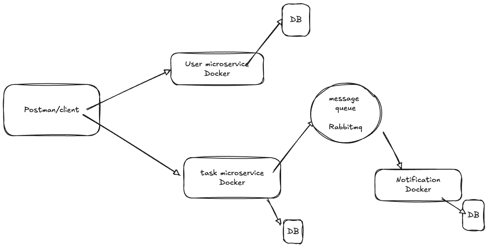

# Task Management App
-  Node.js and Express.js Microservices
-  MongoDB
-  Docker & Docker Compose
-  RabbitMQ

# HLD Design & Architecture


# User Service
### Router
-  GET /users - Get all users
-  POST /users - Create user

### Docker image
```bash
 docker pull mongodb/mongodb-community-server:latest
 docker run -d -p 27017:27017 mongodb/mongodb-community-server:latest
```